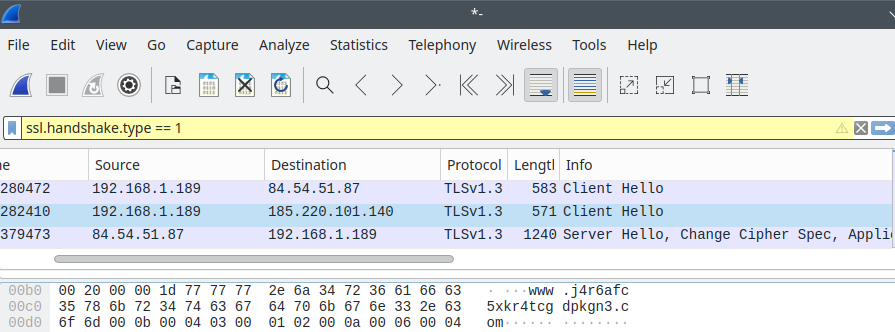

- [Mit árul el rólunk az internet?](#mit-árul-el-rólunk-az-internet)
  - [Mit lát a szolgáltató / az internetes protokoll sebezhetőségei](#mit-lát-a-szolgáltató--az-internetes-protokoll-sebezhetőségei)
    - [Az IP címről](#az-ip-címről)
    - [A titkosítatlan névfeloldás problémái (DNS)](#a-titkosítatlan-névfeloldás-problémái-dns)
    - [Megoldások a névfeloldás eltakarására: DNS-over-HTTPS, DNS-over-TLS](#megoldások-a-névfeloldás-eltakarására-dns-over-https-dns-over-tls)
    - [A titkosított TLS Client Hello üzenetek sebezhetősége](#a-titkosított-tls-client-hello-üzenetek-sebezhetősége)
    - [Megoldás a Client Hello üzenet eltakarására (ECH)](#megoldás-a-client-hello-üzenet-eltakarására-ech)
    - [Konklúzió](#konklúzió)
  - [Mit lát a weboldal, amihez kapcsolódunk?](#mit-lát-a-weboldal-amihez-kapcsolódunk)
    - [Létezik egy oldal, amely megmutatja, hogy mit látnak belőlünk a túloldalon](#létezik-egy-oldal-amely-megmutatja-hogy-mit-látnak-belőlünk-a-túloldalon)
    - [Helymeghatározás IP cím alapján](#helymeghatározás-ip-cím-alapján)
    - [Digitális ujjlenyomatok](#digitális-ujjlenyomatok)
      - [A HTTPS kérés értékes mezői](#a-https-kérés-értékes-mezői)
      - [Javascript (futtatható kód) felhasználása a számítógépünk, telefonunk képességeinek felderítésére](#javascript-futtatható-kód-felhasználása-a-számítógépünk-telefonunk-képességeinek-felderítésére)
    - [Konklúzió](#konklúzió-1)
  - [Információcsere internetes weblapok között](#információcsere-internetes-weblapok-között)
    - [A reklámok, nyomkövetők működése](#a-reklámok-nyomkövetők-működése)
    - [Süti harmadik félnek](#süti-harmadik-félnek)
    - [AMP, gyorsított mobiloldalak](#amp-gyorsított-mobiloldalak)
    - [Konklúzió](#konklúzió-2)
- [Megoldások az információ-áramlás korlátozására](#megoldások-az-információ-áramlás-korlátozására)
  - [Reklámok és nyomkövetők blokkolása](#reklámok-és-nyomkövetők-blokkolása)
  - [A digitális ujjlenyomat meghamisítása](#a-digitális-ujjlenyomat-meghamisítása)
  - [AMP tiltása (gyorsított mobiloldalak)](#amp-tiltása-gyorsított-mobiloldalak)
  - [Javascript (böngésző-program) tiltása](#javascript-böngésző-program-tiltása)
  - [Konklúzió](#konklúzió-3)
- [Úton a teljes sötétség felé](#úton-a-teljes-sötétség-felé)
  - [A TOR hálózat (dark web)](#a-tor-hálózat-dark-web)
    - [A hálózat működése](#a-hálózat-működése)
    - [Legális-e a használata?](#legális-e-a-használata)
    - [A TOR böngésző telepítésének menete](#a-tor-böngésző-telepítésének-menete)
    - [A nyelv átállítása](#a-nyelv-átállítása)
    - [Szkriptek (futtatható kód) tiltása](#szkriptek-futtatható-kód-tiltása)
    - [Semmilyen bővítményt ne telepíts, minimális dolgon változtass](#semmilyen-bővítményt-ne-telepíts-minimális-dolgon-változtass)
    - [Ennyit lát a túloldal](#ennyit-lát-a-túloldal)
    - [Mi történik a TLS Client Hello-val?](#mi-történik-a-tls-client-hello-val)
    - [Az onion címek](#az-onion-címek)
    - [Biztonságos-e a TOR?](#biztonságos-e-a-tor)
    - [Konklúzió](#konklúzió-4)
- [Hogyan viszonyulnak az egyes kiszolgálók a névtelenséghez?](#hogyan-viszonyulnak-az-egyes-kiszolgálók-a-névtelenséghez)
  - [www.google.com](#wwwgooglecom)
  - [www.duckduckgo.com](#wwwduckduckgocom)
  - [www.brave.com](#wwwbravecom)
  - [www.facebook.com](#wwwfacebookcom)
  - [www.cloudflare.com](#wwwcloudflarecom)
  - [Hogyan használhatunk névtelenül szkripteket is?](#hogyan-használhatunk-névtelenül-szkripteket-is)
  - [Konklúzió](#konklúzió-5)


# Mit árul el rólunk az internet?

Felvetődhet a kérdés, hogy internetezés közben valaki belehallgat-e a titkosított adatfolyamokba, hozzájuthat-e értékes információkhoz rólunk. A dokumentum azt elemzi ki, hogy ez elvi szinten lehetséges-e. Hogy a valóságban mi történik, azt nem tudom.

Az elemzéshez a wireshark hálózati analizátort használtam.


## Mit lát a szolgáltató / az internetes protokoll sebezhetőségei

### Az IP címről

Amikor az internetre csatlakozunk, a szolgáltató ad nekünk egy címet, ami egyértelműen azonosít minket. Az előfizetésünk alapján követhetőek vagyunk, tehát ha támadást indítunk, név és cím szerint azonosíthatóak leszünk. Mindez nem probléma, a kérdés, hogy mennyire lát a szolgáltató bele az internetes tevékenységünkbe?

A szolgáltatótól kapott IP cím kinézete:
* IPv4 cím: 104.26.15.72 (négy számból áll)
* IPv6 cím: 2606:4700:20::681a:f48 (hexadecimális számjegyekből áll)

Az IP címünk közelítő információt is elmond a lakhelyünkről bárkinek.

[https://browserleaks.com/ip](https://browserleaks.com/ip)


### A titkosítatlan névfeloldás problémái (DNS)


A névfeloldás azt jelenti, hogy amikor egy weboldalt megkeresünk (pl. www.github.org), akkor a névből IP címet állít elő egy távoli szolgáltatás (140.82.121.3) és az internetes csomagjaink erre a címre fognak elmenni. A kommunikáció titkosítatlan formában történik. Aki belehallgat a hálózati beszélgetésünkbe (lásd kép), tudni fogja, hogy milyen weblapokat látogatunk meg.

Mivel az adatfolyam titkosítatlan, ezért szolgáltató képes hamis választ is visszaadni, vagy másik kiszolgálóhoz átirányítani.

Amikor az állam letiltja a tiltotttartalom.com weboldalt, akkor ezzel az eszközzel él. A csomagjaink nem fognak eljutni az eredeti weblaphoz, hanem egy másik oldal jelenik meg helyette, amelyik értesít, hogy a tartalom tiltásra került.


### Megoldások a névfeloldás eltakarására: DNS-over-HTTPS, DNS-over-TLS

A szakemberek észlelték, hogy a névfeloldásért felelős DNS csomagokkal komoly bajok lehetnek, bárki belematathat, átirányíthat, letilthat lekéréseket, ezért biztonságosabb, ha azok is titkosított csatornán haladnak.
Megjelentek megoldások a DNS forgalom eltakarására publikus DNS névfeloldó rendszerekkel. Ezek a szolgáltatók úgy termelnek pénzt, hogy elemzik a lekéréseket, összképet kapva az internetes szokásainkról.
Elég nekik azt tudni, hogy X millió embert mi érdekel, nincs szükségük a személyes adatainkra. Némelyik szolgáltató pornószűrést, anonimitást és egyéb extra szolgáltatást is biztosít, hogy nekik szolgáltassuk az adatainkat.

A nagyobb publikus DNS szolgáltatók közül a következőket említeném:
* Cloudflare (1.1.1.1, a leggyorsabb, teljes névtelenséget ígér)
* Google (8.8.8.8)

Firefox alatt így lehet a DNS-over-HTTPS-t bekapcsolni Cloudflare alá (Adatvédelem és biztonság almenü).


### A titkosított TLS Client Hello üzenetek sebezhetősége

A DNS-over-TLS vagy a DNS-over-HTTPS bekapcsolásával a szolgáltató többé nem fogja látni a DNS üzeneteinkből, hogy milyen weboldalakat olvasunk. Ezek a megoldások megvédik a névfeloldásért felelős DNS forgalmat.

Viszont ugyanez az adat más forrásból is beszerezhető a TLS internetes protokoll egy sebezhetősége miatt. A TLS az internet titkosításért felelős rétege (Transport Layer Security), ennek a Client Hello üzenetében kódolatlanul, szövegesen utazik a meglátogatandó webhely neve.
Amint a weboldalhoz kapcsolódunk, teljesen láthatóvá válik bárki számára, hogy kivel beszélünk. A lehallgatástól tehát nem véd meg a titkosított DNS, viszont a választ többé már nem lehet meghamisítani, csak letiltani.

Az alábbi képen a titkosított(!) kommunikációt lehallgatva az "alive.github.com" tisztán kivehető:


### Megoldás a Client Hello üzenet eltakarására (ECH)

Természetesen észlelték már a problémát, hogy nem előnyös, ha bárki megtudhatja, hogy milyen oldalakkal beszélgetünk, ezért megjelent az ESNI, majd később ECH megoldás. Az ECH titkosítja a Client Hello üzenetnek a problémás részét, kitakarva belőle minden érzékeny adatot. Az ECH opcionális, jelenleg nagyon kevés weboldal támogatja. Firefox alatt a DNS-over-HTTPS ECH-t is használna, de minthogy az oldalak 95%-a nem implementálta, sokra nem megyünk vele. Reméljük ez megváltozik a jövőben.

### Konklúzió

A legtöbb kapcsolat HTTPS alatt fut és titkosítva van, a szolgáltató nem látja, hogy milyen beszélgetést folytatunk rajta. A DNS/TLS protokollok biztonsági rései miatt viszont elvileg megláthatja a weblapok nevét, amit olvasunk. Azt is lemérheti, hogy mennyit időt töltünk ezeken az oldalakon, ebből az információból pedig egészen pontosan meg lehet tippelni valaki politikai hovatartozását, szokásait, érdeklődési körét névreszólóan. Elvileg nem lehetetlen megszerezni ezeket az adatokat. Bízunk benne, hogy nem teszik meg. Általános megoldás jelenleg nincs a probléma kivédésére, az ECH bizonyos lapokat eltakarhat, de a többségük titkosítatlanul fog átmenni a rendszeren.

## Mit lát a weboldal, amihez kapcsolódunk?

### Létezik egy oldal, amely megmutatja, hogy mit látnak belőlünk a túloldalon

Ha kíváncsiak vagyunk, hogy mit lát a túloldal, érdemes megnyitni a [https://browserleaks.com/](https://browserleaks.com/) honlapot. Ez a weblap megmondja, hogy milyen információk szivárognak át hozzájuk.

### Helymeghatározás IP cím alapján

Az IP címünk a túloldal számára közelítőleg megjelöli, hogy hol vagyunk. Ezt külföldi cikkek úgy fogalmazzák meg, hogy a régiót eltalálja.


### Digitális ujjlenyomatok

A valós életben amikor megfogunk egy tárgyat az ujjlenyomatunk a tárgyon marad és ez annyira egyedi, hogy azonosít minket. Ugyanez történik, amikor egy lekérést kiküldünk egy weboldalhoz. Elküldjük az operációs rendszert, az IP címet, a böngésző típusát, verziószámát, a nyelvet, a kijelző méretét, telepített bővétményeket, jelkészleteket és ezer más tulajdonságot is. Annyi adatot, hogy az már azonosít minket.

#### A HTTPS kérés értékes mezői

Amikor a böngészőnk meglátogat egy oldalt, elküldi a kérésben, hogy milyen böngészőt használunk, ennek verziószámát, az operációs rendszert, meg hogy milyen nyelveken szeretünk olvasni. Nagyon sok adat kikerül, de ez még hiányos a teljes beazonosításhoz.


#### Javascript (futtatható kód) felhasználása a számítógépünk, telefonunk képességeinek felderítésére

A javascript a böngészők programnyelve. Amikor betöltünk egy weboldalt, sokszor egy program is végrehajtódik (javascript), innentől az ujjlenyomat olvasási képességek megsokszorozódnak. Lekérdezhetjük a kijelző méretét, a telepített jelkészleteket, a 3D gyorsítókártya képességeit, a böngésző beállításait, ez egyedivé tehet minket, megkülönböztetve a többi felhasználótól.

A telefonokban 2D/3D hardveres gyorsítók is vannak és mindegyik egy kicsit másképp számol, de majdnem ugyanazt a képet rajzolja ki. Ezek az apró különbségek képesek a telefon, vagy a videókártya típusának egyértelmű beazonosítására.


### Konklúzió

A túloldal látja, hogy milyen tartalmakat olvasunk és a számítógépünk, vagy telefonunk egyediségét kihasználva (ujjlenyomat) képes lehet bejelentkezés nélkül is azonosítani minket. Ha később kiderülne a személyazonosságunk (pl. fizetés), az ujjlenyomatunkat akár teljes névvel és címmel is összeköthetik.

## Információcsere internetes weblapok között

Az internetes oldalak reklámokból és nyomkövetőkből (tracker) élnek. Amikor egy oldalt betöltünk, az oldal elirányít ügynökökhöz is minket. Ezek mindegyike képes tőlünk digitális ujjlenyomatot venni. Van, amelyik csak a reklámját helyezi el, de van olyan is, aki információt gyűjt.

Azért ingyenesek ezek az újságok, mert reklámoznak, vagy pénzért információt szolgáltatnak ki rólunk, ami egy távoli pontban összekötődhet egésszé.

Egy neves magyar újság nyomkövetői Firefox alatt:


### A reklámok, nyomkövetők működése

Nem minden reklámozó követ minket, sok csak felrak egy képet és ha ráklikkelnek pénzt kap érte. A nyomkövető viszont a teljes tevékenységünket követi.

Érdemes megnézni Firefox alatt, hogy milyen csomagok mennek ki, sokat nem kell magyarázni rajta, egyértelmű. (Kitakartam azokat a részeket, amikről nem tudom, hogy micsoda és akár azonosíthatnak is engem).


### Süti harmadik félnek

Ez a technika már kihalóban van, mert a legtöbb böngésző alapból letiltja. A dolog úgy működne, hogy belépek "A" oldalon, kapok egy sütit, amivel legközelebb jelszó nélkül is bejelentkezhetek. Egy ettől teljesen független oldal ("B") felkapja ugyanezt a sütit és elküldi a saját szerveréhez. Ugyan nem fog vele értékes adatokhoz jutni, viszont azonosításra felhasználhatja, mert pontosabb, mint a digitális ujjlenyomat. Teljesen egyedivé tesz minket.

### AMP, gyorsított mobiloldalak

A Google fejlesztése, hogy ahelyett, hogy egyes oldalakat a saját helyükről töltenénk le, a Google szervereiről is megérkezhetnek, ő optimalizálja, felgyorsítja, ezeket az oldalakat. A felhasználó azt gondolja, hogy X, vagy Y oldallal áll mobilkapcsolatban, de ha a csomagokat analizálja az ember, mind a Google irányába fog menni.

### Konklúzió

Hiába nézeget az ember különféle oldalakat, ha mindegyik ugyanazokkal az ügynökségekkel áll kapcsolatban és az információáramlás iránya nagyon kevés helyre összpontosul. Egyes multinacionális cégek gyakorlatilag mindent tudni fognak rólunk.

# Megoldások az információ-áramlás korlátozására

Ebben a fejezetben a Brave böngészőt fogom használni, mert ez a böngésző támogatja a legjobban a magánélet védelmét.


## Reklámok és nyomkövetők blokkolása

A reklámok és nyomkövetők blokkolása szükséges, de nem elégséges lépés a magánélet védelméhez. Ez a lépés kizárólag abban segít, hogy gyorsabban töltődjenek be az oldalak és ne legyenek villogó reklámok.
Ugyanakkor ha az oldal szeretné, maga is továbbküldheti a digitális ujjlenyomatunkat a reklámügynökségnek, akitől a pénzt kapja. Egyáltalán nem lehetetlen, hogy az ügynökséghez eljussanak az adataink, sőt, ilyenkor azt is láthatja, hogy blokkoljuk a reklámokat. Semmiféle védelmet nem nyújt önmagában a blokkolás.

Reklámok blokkolása a Brave böngészőben (Beállítások/Pajzsok):


A lekapcsolt ügynökök:


## A digitális ujjlenyomat meghamisítása

Ezt a funkciót a böngészőben lehet bekapcsolni (Beállítások/Pajzsok):


Az ujjlenyomatot sokféleképpen le lehet venni, az egyik megoldás, hogy kirajzolunk egy szöveget és a létrehozott képpontokból kiszámolunk egy értéket. A lenti képen zölden látszik a létrehozott szöveg. Ez lesz az ujjlenyomatunk (canvas fingerprint). Minden böngésző másképpen rajzol, ez szemmel ritkán látható. Sőt, az is előfordulhat, hogy ha átírják a programot az újabb verziónál kerekítési pontatlanságok miatt megváltozik az ujjlenyomatunk is.


Indítsuk újra a Brave böngészőt, bár szemmel nem lesz észrevehető, de más képet rajzol meg, ami más ujjlenyomatot eredményez.


Hogyan lehet ezt megoldani? Egy lehetséges megoldás, ha 0,1 pixellel eltoljuk vagy a szöveget, vagy a narancssárga négyszöget, ez szemmel látható változást nem fog eredményezni, viszont a létrehozott kép már teljesen más lesz.

A véletlenszerű variálással folyamatosan cserélődhet az ujjlenyomatunk. Ha tiltjuk a reklámokat és összezavarjuk az ujjlenyomatunkat, az már biztosíthat valódi védelmet a magánéletünk számára.


## AMP tiltása (gyorsított mobiloldalak)

Beállítások, adatvédelem és biztonság menu:


Amikor a Brave böngésző AMP URL-t észlel, megpróbálja átirányítani az eredeti helyre, hogy ne a Google szerverein keresztül működjön (ezt de-AMP-nek is hívják, mert átszerkeszti az oldalt, hogy eltűnjenek abból a Google hivatkozások).

## Javascript (böngésző-program) tiltása

Amennyiben a böngésző nem futtathat programokat, úgy ujjlenyomat sem lesz. A tiltás egy nagyon drasztikus megoldás, viszont 100%-os hatékonyságú megoldást biztosít.

A Brave magyar fordítása elég gázosra sikeredett: "Parancsfájlok letiltása", mely a Beállítások/Pajzsok menü alatt szerepel.


## Konklúzió

Sokmindent megpróbálhatunk, hogy eltakarjuk az ujjlenyomatunkat, folyamatos a verseny az ügynökségek és a böngészőgyártók között. A ügynökök ellenőrizni akarnak mindent, a böngészőgyártók meg kibújnak. Mindig lehet olyan pillanat, hogy a reklámügynökség képes leszedni az ujjlenyomatunkat és beazonosítani minket, de rendszerint a következő böngészőverzió ezt javíthatja. Éppen ezért nem lehet teljesen megbízni a hamisított ujjlenyomatban sem.
Egyedül a javascript (böngésző programok) tiltása biztosít 100%-os megoldást.

# Úton a teljes sötétség felé

## A TOR hálózat (dark web)

1990-re világossá váltak az internetes rendszerek problémái, ezért az amerikai haditengerészet megbízta David Goldschlag-ot, Mike Reed-et és Paul Syverson-t, hogy vizsgálják ki, hogy lehetséges-e anonim módon kommunikálni a jelenlegi internetes hálózatokon. Ők készítették el először az onion routing alapkoncepcióját és prototípusát 1995-ben. Ebből nőtt ki a később a TOR hálózat.
A TOR nyílt forrású hálózat, folyamatos fejlesztés alatt áll. Bárki megnézheti a kódját, ellenőrizheti, hogy megfelelően működik-e, fordíthat belőle saját példányt, ha nem bízik a rendelkezésünkre bocsájtott programokban.

### A hálózat működése


A működés egyszerűen:

* kiválasztunk 3 csomópontot véletlenszerűen, lehetőleg 3 különböző országból (ezt automatikusan megcsinálja a rendszer)
* az adatokat 3 kulccsal titkosítjuk
  * először a 3. csomópont (kijárat) publikus kulcsával
  * utána a 2. csomópont (relé) publikus kulcsával
  * utána az 1. csomópont (bejárat) publikus kulcsával
* elküldjük a csomagot az első csomóponthoz
  * ő leveszi az első titkosítást a saját privát kulcsával (1.)
  * ő tudja, hogy honnan jött az üzenet
  * de nem tudja dekódolni, mert 2 privát kulcs még hiányzik neki
  * továbbküldi a második csomópontnak
* megérkezik a második csomóponthoz
  * ő leveszi a titkosítást a saját privát kulcsával (2.)
  * nem tudja, hogy honnan jött az üzenet, csak az előző csomópontot ismeri
  * nem tudja dekódolni sem, mert hiányzik neki még egy privát kulcs
  * továbbküldi a következő csomópontnak
* megérkezik a harmadik csomóponthoz
  * ő leveszi az utolsó titkosítást is a saját privát kulcsával (3.)
  * ekkor az üzenet már olvasható
  * viszont a 3 csomópontból csak az utolsót ismeri, senki mást
  * tippelni sem tudja, hogy honnan jött az üzenet
  * továbbküldi a kiszolgáló felé

A 3 kulcsos működés során a gépek csak az előző és az utánuk lévő csomópontokat ismerik, a többi adat titkosítva van, több ezer év lenne visszafejteni.

Mikor lehetne dekódolni? Ha mind a 3 csomópont ugyanannak a szervezetnek a kezében lenne.

Szerencsére nagyon sok magánember is biztosít TOR bejáratot, relét és kijáratot, ezért kicsi a valószínűsége, hogy mind a 3 csomópontot ugyanaz birtokolja.

### Legális-e a használata?

Vannak országok, ahol tiltják a TOR hálózatot (ahol erős a cenzúra), viszont Magyarországon jelenleg szabad használni. Vannak KFT-k is, amelyek tor végpontokat üzemeltetnek.

### A TOR böngésző telepítésének menete

Amennyiben anonimitást szeretnénk, minimalizálni kell azoknak számát, akiben megbízunk. Teljes anonimitás nincs, de ha kevés a szereplő a történetben, akár szerencsénk is lehet. A TOR böngészőt kizárólag a hivatalos oldalukról érdemes telepíteni a [https://www.torproject.org](https://www.torproject.org)-ról.

Linux alatt mutatom be ennek a menetét:

* először letöltjük a böngészőt
* utána letöltjük az aláírás fájlt
* utána ellenőrizzük, hogy az aláírás stimmel-e


Az ellenőrzés menete:

```
gpg --auto-key-locate nodefault,wkd --locate-keys torbrowser@torproject.org
```


Erre a következő választ kaphatjuk:

```
gpg: key 4E2C6E8793298290: "Tor Browser Developers (signing key) <torbrowser@torproject.org>" not changed
gpg: Összesen feldolgoztam: 1
gpg:              változatlan: 1
pub   rsa4096 2014-12-15 [C] [expires: 2025-07-21]
      EF6E286DDA85EA2A4BA7DE684E2C6E8793298290
uid           [ unknown] Tor Browser Developers (signing key) <torbrowser@torproject.org>
sub   rsa4096 2021-09-17 [S] [expires: 2024-08-23]
```

A kulcsot beleírjuk egy fájlba:

```
gpg --output ./tor.keyring --export 0xEF6E286DDA85EA2A4BA7DE684E2C6E8793298290
```

Utána leellenőrizzük vele a letöltést:

```
gpgv --keyring ./tor.keyring ~/Downloads/tor-browser-linux-x86_64-13.5.tar.xz.asc ~/Downloads/tor-browser-linux-x86_64-13.5.tar.xz
```

Eredmény:

```
gpgv: Signature made 2024. jún. 20., csütörtök, 20:06:55 CEST
gpgv:                using RSA key 613188FC5BE2176E3ED54901E53D989A9E2D47BF
gpgv: Good signature from "Tor Browser Developers (signing key) <torbrowser@torproject.org>"
```

A "good signature" jelenti azt, hogy sikerült az ellenőrzés. Azt töltöttük le, amit a weboldal adott nekünk. Ezután kedvünkre telepíthetjük. Elsőre kissé macerásnak tűnhet, de ellenőrizetlen forrásból nem érdemes letölteni, mert egy csomó kézen átmehet és fogalmunk sem lesz róla, ki milyen kiskaput rak bele. Semmilyen biztonságot nem nyújtanak a nagy szoftveráruházból telepített példányok.


### A nyelv átállítása

Kis ország vagyunk, kevés TOR felhasználóval. Ha alapértelmezetten magyar nyelven kérsz le weboldalt, azonnal elveszíted az anonimitásodat. Kevés emberből könnyű megtalálni a forrást.


### Szkriptek (futtatható kód) tiltása

Amennyiben a javascript engedélyezve van, bárki ujjlenyomatot vehet tőled TOR böngésző alatt is. Tiltsd le:


### Semmilyen bővítményt ne telepíts, minimális dolgon változtass

Sok bővítmény kiskapuként is szolgálhat, ha átküldi a túloldalra az IP címedet, rögtön azonosíthatóvá válsz.

### Ennyit lát a túloldal

Valahol Bécsben vagyok. :)


### Mi történik a TLS Client Hello-val?

Semmilyen értelmes információ  nem olvasható ki belőle. Valami tor bejárati csomóponthoz kapcsolódunk.



### Az onion címek

A tor hálózatnak saját címzése is van, ami nem is hasonlít a jól megszokott DNS-re. Leginkább össze-vissza karakterekből áll. A két pont kiválaszt magának egy köztes találkozóhelyet egy tor csomópontban, ahol információt cserélhetnek. A kiszolgáló nem fogja ismerni az ügyfelet, az ügyfél sem a kiszolgálót, minden titokban fog maradni.

A brave kereső onion címe:
[https://search.brave4u7jddbv7cyviptqjc7jusxh72uik7zt6adtckl5f4nwy2v72qd.onion/](https://search.brave4u7jddbv7cyviptqjc7jusxh72uik7zt6adtckl5f4nwy2v72qd.onion/)

### Biztonságos-e a TOR?

Legalább annyira, mint egy kivilágítatlan városban sétálni az utcán a sötét éjszakában. Sosem tudhatod, hogy ki van a túloldalon és milyen szándékkal közeledik feléd. Alapszabály a TOR hálózatokon, hogy senkiben nem lehet megbízni. A jelenlegi internettel vannak komoly problémák, de egy TOR hálózat a maga ellenőrizetlensége miatt rémálommá válhat. Fel kell tenni a kérdést, hogy mi a rosszabb: ha megfigyelnek, vagy ha megszűnik a törvény ereje?

### Konklúzió

A véleményem szerint a jelenlegi internet legnagyobb problémája nem a beazonosíthatóság, hanem az, hogy ezt magánvállalatok bírósági végzések nélkül is megtehetik. Bárki bármibe belehallgathat a túloldal megkérdezése és bármiféle következmény nélkül. Erre válasz a TOR hálózat, ami visszavezet a 80-as évek világába: vírusok, illegális tartalmak, bűnszervezetek a neten. A hálózat nem örvendene ekkora népszerűségnek, ha magánjellegű tartalmakba csak okkal nézhetnének bele, kizárólag állami rendfenntartó hatóságok.

# Hogyan viszonyulnak az egyes kiszolgálók a névtelenséghez?

## www.google.com

TBD

## www.duckduckgo.com

TBD

## www.brave.com

TBD

## www.facebook.com

TBD

## www.cloudflare.com

TBD

## Hogyan használhatunk névtelenül szkripteket is?

TBD

## Konklúzió

TBD
